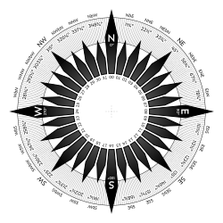

# 6gNext functions

### data format:
For a sample data format, check data.json file.   
To find specific trajectories that are generated and not reported by UAVs, This key is added by "mutate" function.
```json
{"origin":  "mutate"}
```

### Notes
- function container in tinyfaas doesn't have build tools for some python libraries, so we need to build the wheel in a separate environment.
- Note tracing has sampling.always_on, so it will be costly. You may change it in production.
- Compass rose is used as reference for directions (0 degree is north):


## Install on a Server
add docker repo
```bash
# Add Docker's official GPG key:
sudo apt-get update
sudo apt-get install ca-certificates curl
sudo install -m 0755 -d /etc/apt/keyrings
sudo curl -fsSL https://download.docker.com/linux/debian/gpg -o /etc/apt/keyrings/docker.asc
sudo chmod a+r /etc/apt/keyrings/docker.asc

# Add the repository to Apt sources:
echo \
  "deb [arch=$(dpkg --print-architecture) signed-by=/etc/apt/keyrings/docker.asc] https://download.docker.com/linux/debian \
  $(. /etc/os-release && echo "$VERSION_CODENAME") stable" | \
  sudo tee /etc/apt/sources.list.d/docker.list > /dev/null
sudo apt-get update
```

install recent docker and other required packages
```bash
sudo apt update && sudo apt install -y neovim tmux bat htop libavutil-dev git-core make zip docker-ce docker-ce-cli containerd.io docker-buildx-plugin docker-compose-plugin
```
You may need to `sudo groupadd docker` and `sudo usermod -aG docker ${USER}` and restart
```bash
wget https://go.dev/dl/go1.22.5.linux-amd64.tar.gz
sudo tar -C /usr/local -xzf go1.22.5.linux-amd64.tar.gz #for amd based (cloud)
rm go1.22.5.linux-amd64.tar.gz
```
Then add these lines to `~.profile` and  run `source ~/.profile` to apply changes:
```bash
PATH=$PATH:/usr/local/go/bin  
GOPATH=$HOME/go
alias bat="batcat"
```
get tinyfaas
```bash
git clone https://github.com/OpenFogStack/tinyFaaS.git
```
Then you should modify tinyfaas to support build tools.

run kafka, jaeger, mongodb, and Ingester vias `docker compose`.
Note that Kafka advertised address should be the public IP of the server.
Also, the 'ingester' service should be modified to use the public IP of Kafka.
```bash
mkdir 6gn && cd 6gn
nvim docker-compose.yml
docker compose  up -d --build
```

## MQTT QoS
The UAV clients should use a QoS level of 0 for sending updates. But the Release function should use QoS level 1. The release message should be sent with a unique identifier to prevent the UAVs from executing the release command multiple times.

`qos=0`: At most once delivery (default). The message is sent once with no guarantee of delivery.
`qos=1`: At least once delivery. The broker acknowledges receipt of the message. If the acknowledgment is not received within a timeout, the client will resend the message.
`qos=2`: Exactly once delivery. This ensures that the message is delivered exactly once to the subscribers. It involves a more complex handshaking process between the client and the broker.

## Secutiry and Performance Considerations
- Mongodb and Mosquitto are not secure by default. You should add authentication and authorization.
- tinyFaaS functions supposed not to be available from internet. They are not supposed to be called by anyone but the ingester.
- functions and ingester will send all trace samples to jaeger by default. You may want to change the sampling rate or disable it.

## Copyright Notice
For any usage, modifications, or distribution, please contact the project maintainer and repository owner at malekabbasi@tu-berlin.de. All rights reserved.

This notice must be included in any copy, modification, or distribution of the project's files.


